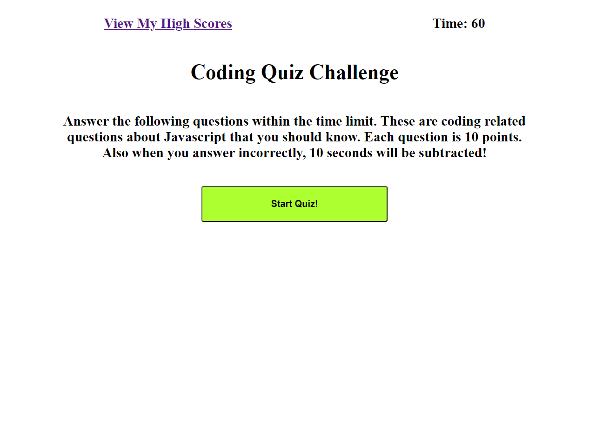
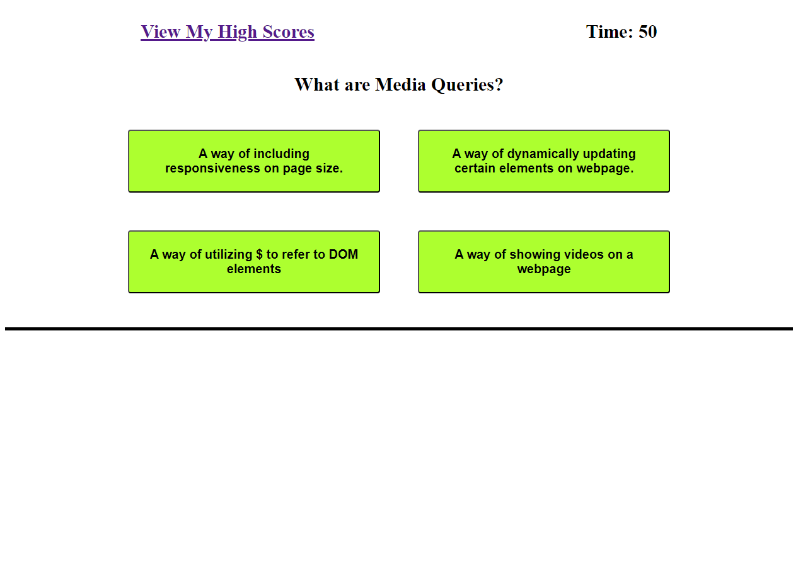
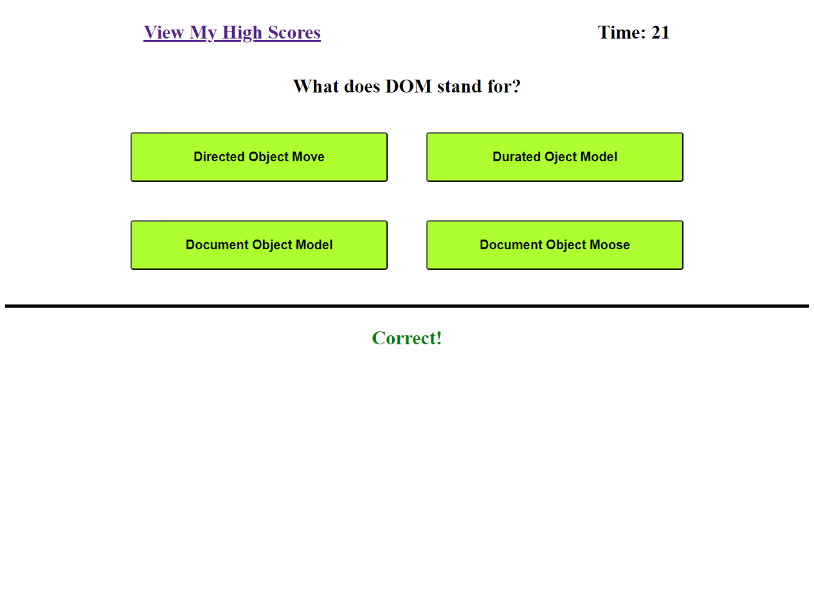
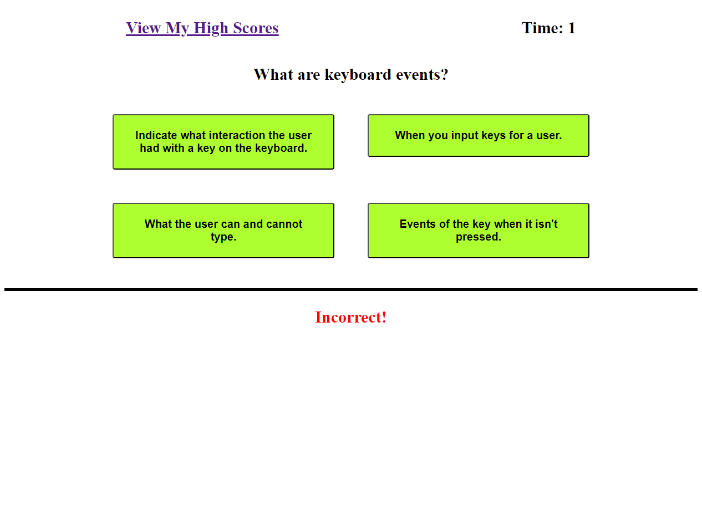
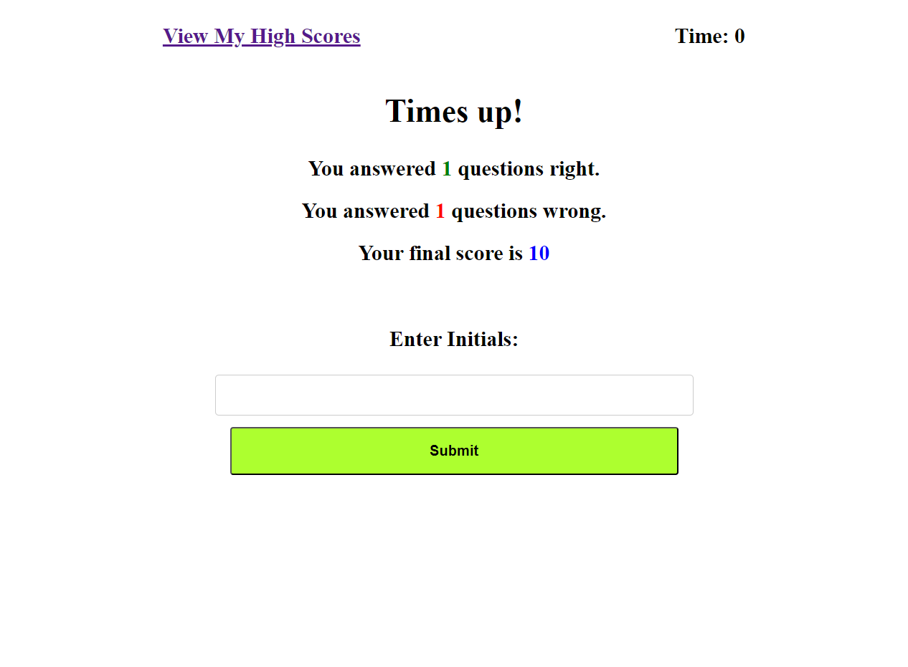
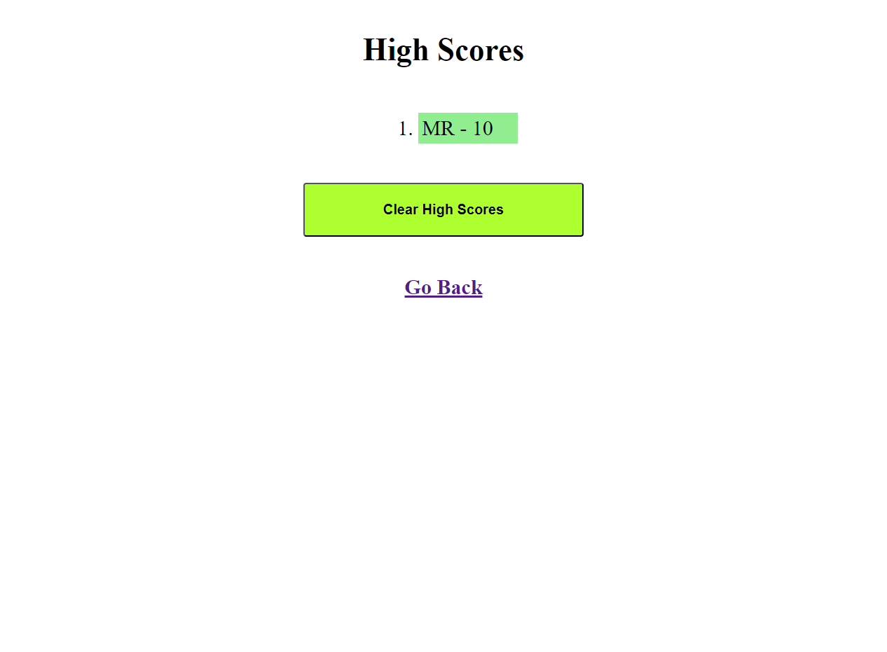

# Timed Coding Quiz

## Description

This is a website built that utilizes JavaScript. The website is a quiz game of sorts. As the user answers questions, it dynamically updates the page. It also has a time interval that countdowns from 60 seconds. The score is shown at the end. Also high scores are stored in local storage as an array. It is then display in the highScore page. Click the link and click on Start Quiz to see how high you can score. 

## Website URL

https://rallomatt.github.io/timedQuiz/

## Screenshot

## License

Please refer to the LICENSE in the repo.